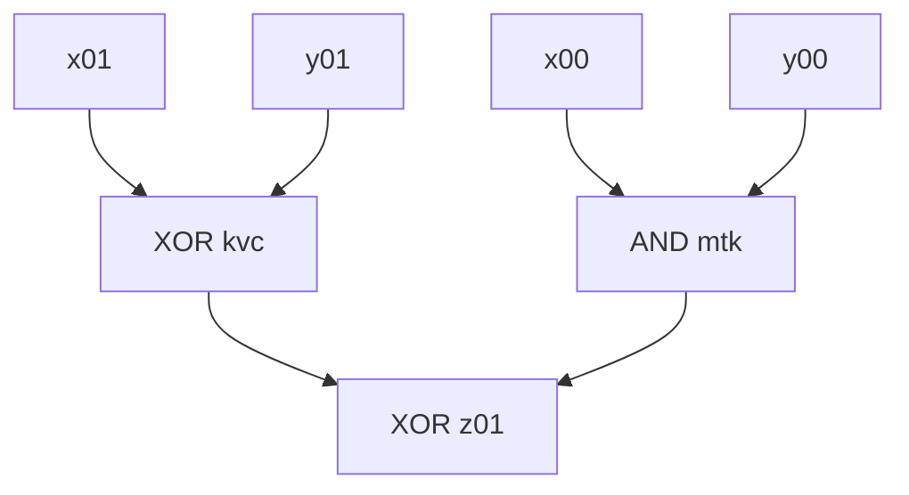

# digit 5 (first inconsistency)

```mermaid
flowchart TD

subgraph "input"
subgraph " "
  x00
  y00
end
subgraph " "
  x01
  y01
end
subgraph " "
  x02
  y02
end
subgraph " "
  x03
  y03
end
subgraph " "
  x04
  y04
end
subgraph " "
  x05
  y05
end
end

// these 2 are sus, only Z's are second inputs in other cases
(qjq,List(frn, jcf))
(kbj,List(frn, jcf))
(mjj,List(gmq, nrs))
(fqr,List(gmq, nrs))


(mtk,List(jjp, z01))
(kvc,List(jjp, z01))
(cqp,List(trv, z02))
(dqm,List(trv, z02))
(htm,List(kvt, z03))
(ndn,List(kvt, z03))
(drd,List(rhr, z04))
(wkb,List(rhr, z04))
(ghf,List(mgg, z06))
(frn,List(mgg, z06))
(gcf,List(mpv, z07))
(fhw,List(mpv, z07))
(twt,List(bbk, z08))
(grg,List(bbk, z08))
(dgj,List(bfb, z09))
(jwv,List(bfb, z09))
(hkf,List(crj, z10))
(pmq,List(crj, z10))
(shm,List(rjm, z11))
(tmd,List(rjm, z11))
(fgq,List(hfb, z12))
(tff,List(hfb, z12))
(rfq,List(vkk, z13))
(tqf,List(vkk, z13))
(mmr,List(rwf, z14))
(qdc,List(rwf, z14))
(wkq,List(grv, z15))
(tfv,List(grv, z15))
(rsk,List(pjp, z16))
(wnf,List(pjp, z16))
(fpd,List(tqm, z17))
(smg,List(tqm, z17))
(hvs,List(gmf, z18))
(tsn,List(gmf, z18))
(dtb,List(twb, z19))
(tsf,List(twb, z19))
(msw,List(rss, z20))
(qqp,List(rss, z20))
(jsr,List(fjh, z22))
(kkq,List(fjh, z22))
(gwm,List(qbq, z23))
(wwn,List(qbq, z23))
(kmj,List(gqj, z24))
(fnh,List(gqj, z24))
(dtj,List(frh, z25))
(hfj,List(frh, z25))
(fgv,List(vvt, z26))
(bhw,List(vvt, z26))
(vgs,List(wtd, z27))
(knf,List(wtd, z27))
(chk,List(gnp, z28))
(nvq,List(gnp, z28))
(kkh,List(kgw, z29))
(bsb,List(kgw, z29))
(snr,List(htp, z30))
(crb,List(htp, z30))
(dbv,List(gdw, z31))
(vhs,List(gdw, z31))
(bsn,List(fpm, z32))
(jgg,List(fpm, z32))
(srn,List(bqr, z33))
(kth,List(bqr, z33))
(jgv,List(mph, z34))
(dkh,List(mph, z34))
(stg,List(bcc, z35))
(kdv,List(bcc, z35))
(rwh,List(qqs, z36))
(hhn,List(qqs, z36))
(mwj,List(qhk, z37))
(qns,List(qhk, z37))
(vds,List(skn, z38))
(gdk,List(skn, z38))
(bkq,List(wtt, z39))
(jhv,List(wtt, z39))
(mdn,List(qkq, z40))
(jhf,List(qkq, z40))
(wkh,List(vrq, z41))
(pmn,List(vrq, z41))
(mvk,List(nrr, z42))
(tkc,List(nrr, z42))
(qmr,List(frs, z43))
(wqr,List(frs, z43))
(vjg,List(gkc, z44))
(kmg,List(gkc, z44))


srp --> z05[OR z05]
jcf --> z05[OR z05]
y05 --> srp[AND srp]
x05 --> srp[AND srp]
kbj --> jcf[AND jcf]
qjq --> jcf[AND jcf]
x05 --> kbj[XOR kbj]
y05 --> kbj[XOR kbj]
rhr --> qjq[OR qjq]
ccq --> qjq[OR qjq]
drd --> rhr[AND rhr]
wkb --> rhr[AND rhr]
kvt --> drd[OR drd]
ftb --> drd[OR drd]
htm --> kvt[AND kvt]
ndn --> kvt[AND kvt]
rks --> htm[OR htm]
trv --> htm[OR htm]
x02 --> rks[AND rks]
y02 --> rks[AND rks]
cqp --> trv[AND trv]
dqm --> trv[AND trv]
vfb --> cqp[OR cqp]
jjp --> cqp[OR cqp]
y01 --> vfb[AND vfb]
x01 --> vfb[AND vfb]
mtk --> jjp[AND jjp]
kvc --> jjp[AND jjp]
x00 --> mtk[AND mtk]
y00 --> mtk[AND mtk]
x01 --> kvc[XOR kvc]
y01 --> kvc[XOR kvc]
y02 --> dqm[XOR dqm]
x02 --> dqm[XOR dqm]
y03 --> ndn[XOR ndn]
x03 --> ndn[XOR ndn]
y03 --> ftb[AND ftb]
x03 --> ftb[AND ftb]
y04 --> wkb[XOR wkb]
x04 --> wkb[XOR wkb]
x04 --> ccq[AND ccq]
y04 --> ccq[AND ccq]
```




z01 true 2 2
z02 false 2 3
z03 false 2 3
z04 false 2 3
z05 false 2 4
z06 false 2 3
z07 false 2 3
z08 false 2 3
z09 false 2 3
z10 false 2 3
z11 false 2 3
z12 false 2 3
z13 false 2 3
z14 false 2 3
z15 true 2 3
z16 false 2 3
z17 false 2 3
z18 false 2 3
z19 false 2 3
z20 false 2 3
z21 false 1 -1
z22 false 2 4
z23 false 2 3
z24 false 2 3
z25 false 2 3
z26 false 2 3
z27 false 2 3
z28 true 2 3
z29 false 2 3
z30 false 2 3
z31 true 2 3
z32 false 2 3
z33 false 2 3
z34 true 2 3
z35 false 2 3
z36 false 2 3
z37 true 2 3
z38 false 2 3
z39 false 2 3
z40 false 2 3
z41 true 2 3
z42 true 2 3
z43 true 2 3
z44 false 2 3