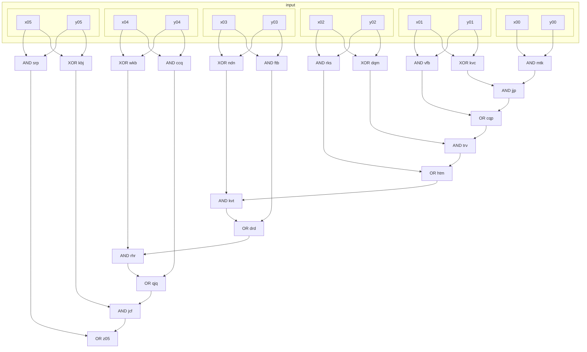

# digit 5 (first inconsistency)

```mermaid
flowchart TD

subgraph "input"
subgraph " "
  x00
  y00
end
subgraph " "
  x01
  y01
end
subgraph " "
  x02
  y02
end
subgraph " "
  x03
  y03
end
subgraph " "
  x04
  y04
end
subgraph " "
  x05
  y05
end
end


srp --> z05[OR z05]
jcf --> z05[OR z05]
y05 --> srp[AND srp]
x05 --> srp[AND srp]
kbj --> jcf[AND jcf]
qjq --> jcf[AND jcf]
x05 --> kbj[XOR kbj]
y05 --> kbj[XOR kbj]
rhr --> qjq[OR qjq]
ccq --> qjq[OR qjq]
drd --> rhr[AND rhr]
wkb --> rhr[AND rhr]
kvt --> drd[OR drd]
ftb --> drd[OR drd]
htm --> kvt[AND kvt]
ndn --> kvt[AND kvt]
rks --> htm[OR htm]
trv --> htm[OR htm]
x02 --> rks[AND rks]
y02 --> rks[AND rks]
cqp --> trv[AND trv]
dqm --> trv[AND trv]
vfb --> cqp[OR cqp]
jjp --> cqp[OR cqp]
y01 --> vfb[AND vfb]
x01 --> vfb[AND vfb]
mtk --> jjp[AND jjp]
kvc --> jjp[AND jjp]
x00 --> mtk[AND mtk]
y00 --> mtk[AND mtk]
x01 --> kvc[XOR kvc]
y01 --> kvc[XOR kvc]
y02 --> dqm[XOR dqm]
x02 --> dqm[XOR dqm]
y03 --> ndn[XOR ndn]
x03 --> ndn[XOR ndn]
y03 --> ftb[AND ftb]
x03 --> ftb[AND ftb]
y04 --> wkb[XOR wkb]
x04 --> wkb[XOR wkb]
x04 --> ccq[AND ccq]
y04 --> ccq[AND ccq]
```
